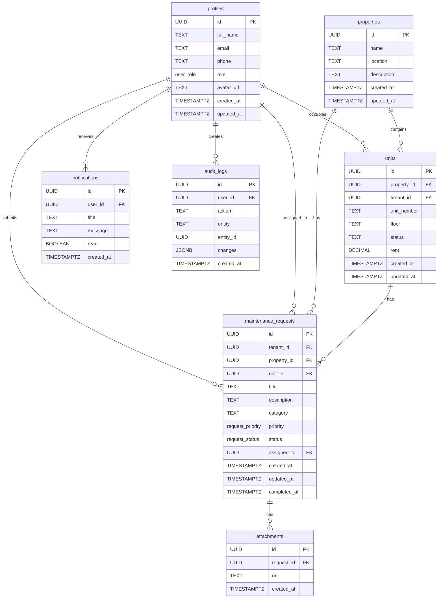

# Database Entity-Relationship Diagram

```mermaid
erDiagram
    profiles ||--o{ units : "occupies"
    profiles ||--o{ maintenance_requests : "submits"
    profiles ||--o{ maintenance_requests : "assigned_to"
    profiles ||--o{ notifications : "receives"
    profiles ||--o{ audit_logs : "creates"

    properties ||--o{ units : "contains"
    properties ||--o{ maintenance_requests : "has"

    units ||--o{ maintenance_requests : "has"

    maintenance_requests ||--o{ attachments : "has"

    profiles {
        UUID id PK
        TEXT full_name
        TEXT email
        TEXT phone
        user_role role
        TEXT avatar_url
        TIMESTAMPTZ created_at
        TIMESTAMPTZ updated_at
    }

    properties {
        UUID id PK
        TEXT name
        TEXT location
        TEXT description
        TIMESTAMPTZ created_at
        TIMESTAMPTZ updated_at
    }

    units {
        UUID id PK
        UUID property_id FK
        UUID tenant_id FK
        TEXT unit_number
        TEXT floor
        TEXT status
        DECIMAL rent
        TIMESTAMPTZ created_at
        TIMESTAMPTZ updated_at
    }

    maintenance_requests {
        UUID id PK
        UUID tenant_id FK
        UUID property_id FK
        UUID unit_id FK
        TEXT title
        TEXT description
        TEXT category
        request_priority priority
        request_status status
        UUID assigned_to FK
        TIMESTAMPTZ created_at
        TIMESTAMPTZ updated_at
        TIMESTAMPTZ completed_at
    }

    attachments {
        UUID id PK
        UUID request_id FK
        TEXT url
        TIMESTAMPTZ created_at
    }

    notifications {
        UUID id PK
        UUID user_id FK
        TEXT title
        TEXT message
        BOOLEAN read
        TIMESTAMPTZ created_at
    }

    audit_logs {
        UUID id PK
        UUID user_id FK
        TEXT action
        TEXT entity
        UUID entity_id
        JSONB changes
        TIMESTAMPTZ created_at
    }
```
